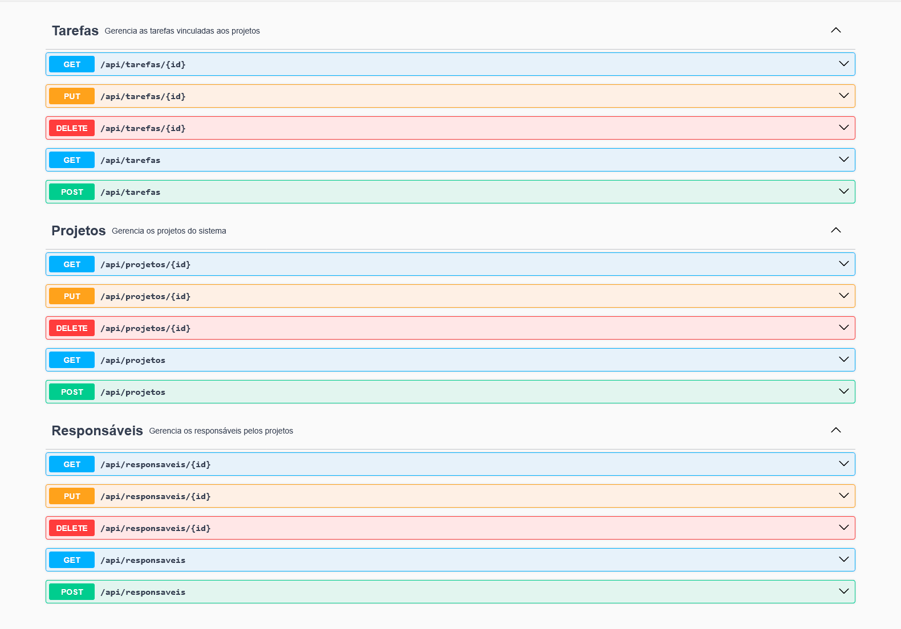

# Sistema de Controle de Projetos

Este projeto consiste em uma API REST desenvolvida em Java 17 com Spring Boot, Maven e MySQL. O objetivo é disponibilizar um sistema simples para gerenciar Projetos, Tarefas e Responsáveis.

A aplicação foi construída para fins acadêmicos, seguindo boas práticas básicas de organização e utilizando o Spring Boot como framework principal.

---

## Tecnologias Utilizadas

* Java 17
* Spring Boot
* Spring Web
* Spring Data JPA
* Maven
* MySQL
* SpringDoc OpenAPI (Swagger)

---

## Pré-requisitos

Antes de rodar o projeto, certifique-se de ter instalado:

* Java 17 ou superior
* Maven
* MySQL Server
* MySQL Workbench (opcional, porém recomendado)
* IntelliJ IDEA ou Eclipse

---

## Configuração do Banco de Dados

1. Abra o MySQL Workbench.
2. Crie o banco de dados executando:

```sql
CREATE DATABASE controle_projetos;
```

3. O Spring Boot irá criar automaticamente as tabelas ao iniciar a aplicação.

4. Atualize o arquivo `src/main/resources/application.properties` com seu usuário e senha do MySQL:

```
spring.datasource.url=jdbc:mysql://localhost:3306/controle_projetos
spring.datasource.username=USUARIO
spring.datasource.password=SENHA
spring.jpa.hibernate.ddl-auto=update
```

---

## Como Executar o Projeto

### IntelliJ IDEA

1. Abra o IntelliJ e selecione "Open".
2. Escolha a pasta do projeto `controle-projetos-api`.
3. Aguarde o Maven baixar as dependências.
4. Abra a classe `Principal` localizada em:
   `src/main/java/br/edu/ceub/controleprojetos/Principal.java`
5. Execute a aplicação clicando em "Run".

### Eclipse

1. Abra o Eclipse.
2. Vá em `File > Import > Existing Maven Project`.
3. Selecione a pasta `controle-projetos-api`.
4. Aguarde o Maven baixar as dependências.
5. Abra a classe `Principal` e execute como "Java Application".

---

## Acesso ao Swagger

Após iniciar o servidor, abra no navegador:

```
http://localhost:8080/swagger-ui/index.html
```

A partir dessa interface você pode testar todos os endpoints sem necessidade de ferramentas externas.

---

## Estrutura da API

### Responsável

* Criar, listar, atualizar e remover responsáveis.
* Um responsável pode estar vinculado a vários projetos.

### Projeto

* Possui um responsável.
* Pode conter várias tarefas.

### Tarefa

* Pertence a um projeto específico.

<br>
A seguir está uma visão geral dos endpoints disponíveis na aplicação, conforme exibido no Swagger:

<p align="center">
  
</p>

---

## Testes HTTP (IntelliJ)

O projeto inclui um arquivo de testes:

```
src/test/http/api-tests.http
```

Esse arquivo contém requisições pré-prontas para testar toda a API diretamente pelo IntelliJ IDEA.